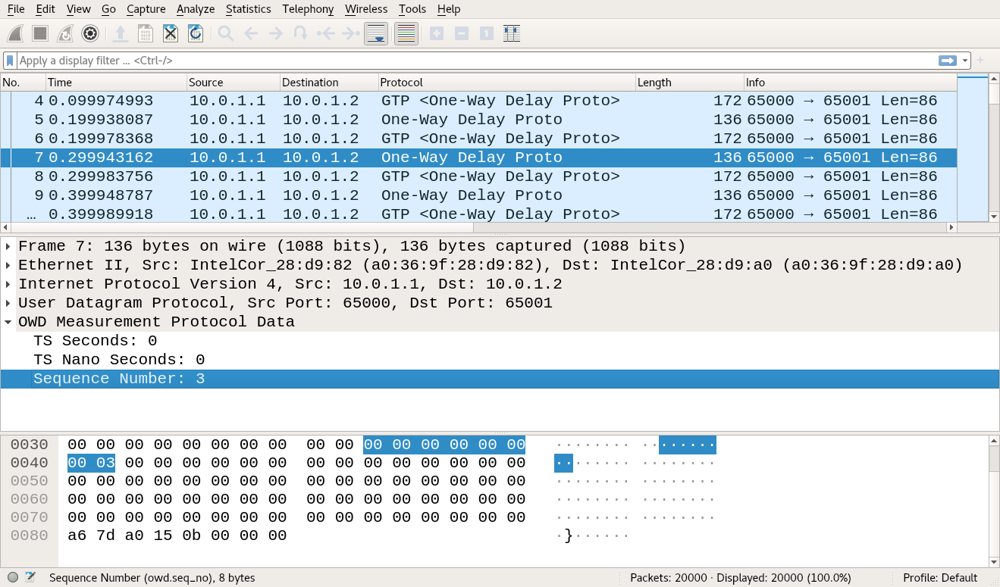

## Structure of measurement data

### Content

The measurement data contents traces of the packets sent by the traffic generator via the switch and DUT, and then captured also at the
traffic generator. 
The traces are stored as Packet Captures (PCAPs) with nanosecond timestamp precision.  
During the double-blind review only a subset of the traces are provided due to GitHub's storage constraints.
After review the traces will be provided by the author's cloud storage.
The provided traces were compressed using gzip, hence to uncompress use:
```
$ tar -xcvf logs.tar.gz
```

### Structure

The measurement traces (PCAPs) are organized as follows:
```
$ tree logs --charset=ascii
logs
`-- dpdk
    |-- download
    |   |-- 1024.100000.core.pcap
    |   |-- 1024.10000.core.pcap
    |   |-- 1024.1000.core.pcap
....
    `-- upload
        |-- 1024.100000.core.pcap
        |-- 1024.10000.core.pcap
        |-- 1024.1000.core.pcap
...
```
The first directory specifies the DUT type either `XDP`, `DPDK`, or `P4`.
After the DUT type the traffic direction follows.
The traffic direction can be either `download`, i.e. GTP encapsulation, or `upload`, i.e. GTP decapsulation.
The file name is divided into `<packet size (bytes)>.<packet rate (packets/s)>.core.pcap`.

### Captured Packets

The packets are truncated to 160bytes maximum.
Therefore, Wireshark complains when the truncated packet is smaller then the specified size in the header.
A Wireshark dissector [owd-measurement-packet-dissector.lua](../owd-measurement-packet-dissector.lua) is available to automatically parse the sequence number of a measurement packet.

The following screenshot shows the content of the `128.10.core.pcap` PCAP for XDP in download direction.



The original measurement packets (*One-Way Delay Proto*) can be seen and its corresponding GTP packet
(*GTP <One-Way Delay Proto>*).
For the DUT latency the RX timestamps of the packets are used to calculate the time difference.
E.g. the time difference between packet (Seq.No. 3) 7 and its corresponding GTP packet 8 is about 40us.
